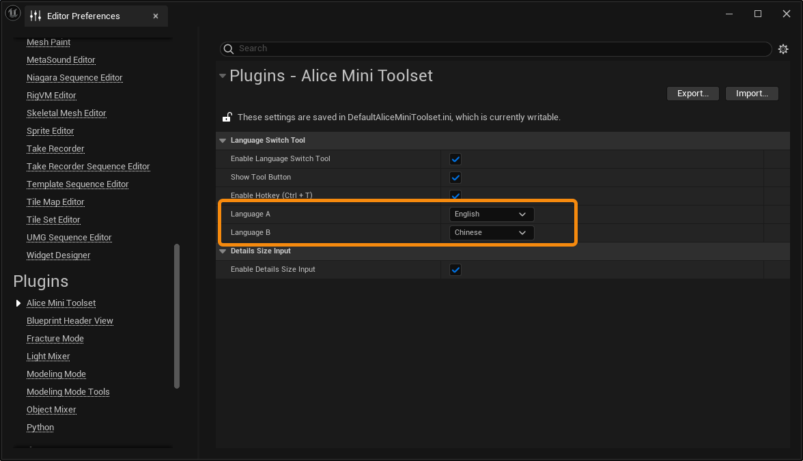
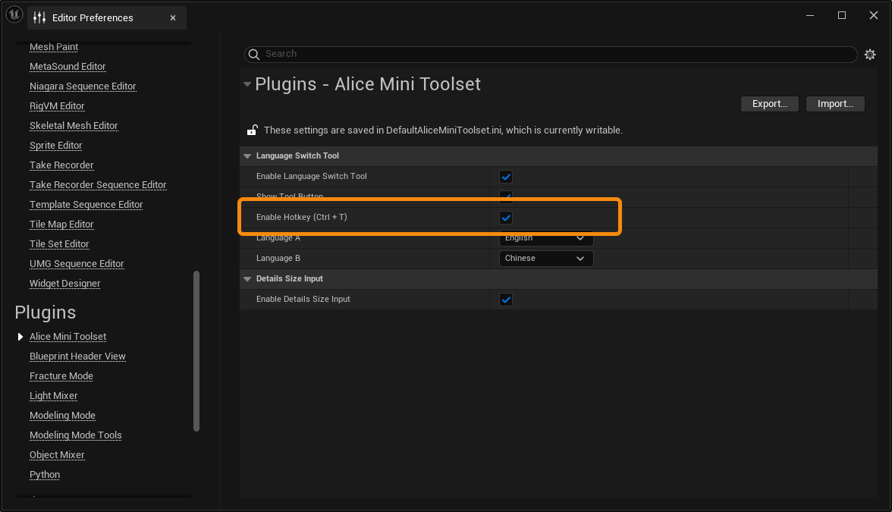

The **Alice Mini Toolset** is an editor mini toolset that is updated irregularly, designed to integrate and release a series of simple and useful free editor tools. Currently, it includes two tools: "Details Size Input" and "Language Switch Tool."

If you find that you have any small needs regarding the Unreal Engine editor, and if you believe that they can be developed into simple and valuable tools, feel free to contact us. We will create and add them to this free toolset.

# Install

Download the AliceMiniToolset plugin, open the Unreal Engine editor, go to **Settings -> Plugins**, search for **AliceMiniToolset** in the Plugins panel, and check the box to enable the plugin.

# Details Size Input

The **Details Size Input** tool adds a Size input to the SceneComponent details panel, allowing you to directly preview or edit the actual size of the SceneComponent in the level.

At the Actor level, the Size input will display or edit the overall size of all SceneComponent components within the Actor.

## Enable Tool

Go to **Edit -> Editor Preferences**, find the **Alice Mini Toolset** settings under the **Plugins** category. Check **Enable Details Size Input** to enable the tool.

Once enabled, select any Actor in the scene, and you will see a new Size input under the Scale property in the details panel.

## Tool Details

When you select an **Actor**, the overall size of the Actor will be displayed. This size represents the total space occupied by all SceneComponents within the Actor.

When you edit the Actor's size, the corresponding scale value will be applied to the entire Actor based on this total space size.

When you select a **Component**, if it is a SceneComponent, the Size will display the actual size of the object in space. This size will adjust according to the parent object and the component's own scaling value.

For example, Cube1 is a cube with a size of 100x100x100, but because its Actor has a scaling value of 0.8, its size is now 80x80x80.

In the Blueprint editor, regardless of whether a SceneComponent is a child of another SceneComponent, it will only display its own local size.

This is a functional limitation because we cannot effectively retrieve parent information from a Blueprint's USCS_Node, which prevents us from calculating the scaling value of a SceneComponent's parent.

# Language Switch Tool

The **Language Switch Tool** allows you to easily switch the display language of the Unreal Engine editor. You can set two target languages and toggle between them using a button or a keyboard shortcut.

## Enable Tool

Go to **Edit -> Editor Preferences**, find the **Alice Mini Toolset** settings under the **Plugins** category. Check **Enable Language Switch Tool** to enable the tool.

You can specify the target languages in the settings.

By enabling or disabling **Show Tool Button**, you can control whether the switch button is displayed on the Toolbar panel.

By enabling or disabling **Enable Hotkey (Ctrl+T)**, you can turn the tool's toggle shortcut (Ctrl+T) on or off.

