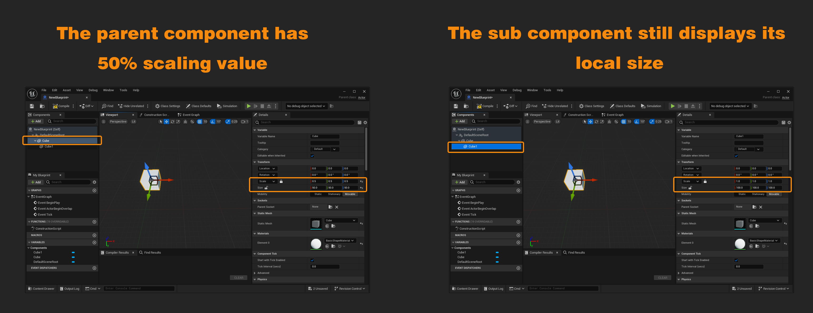
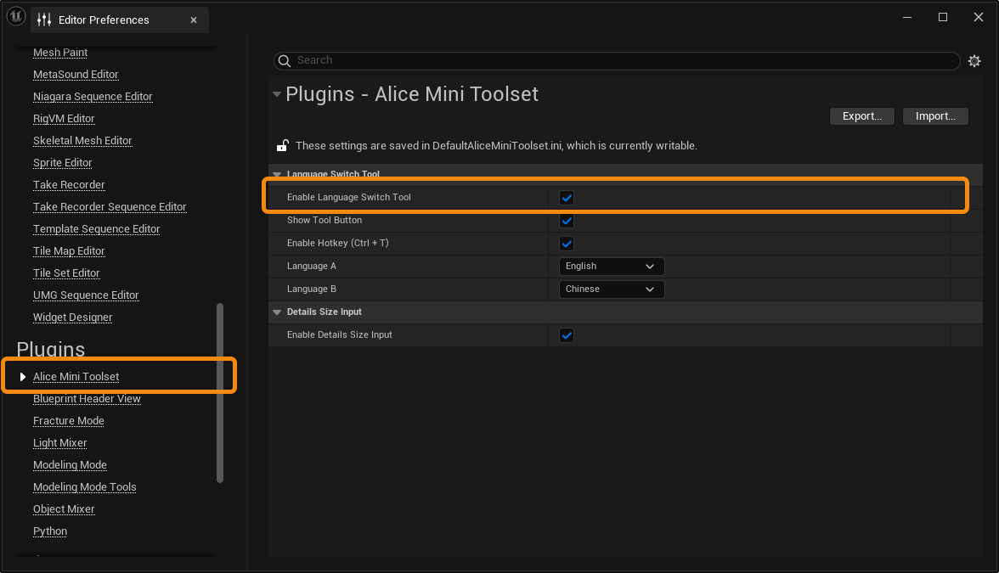
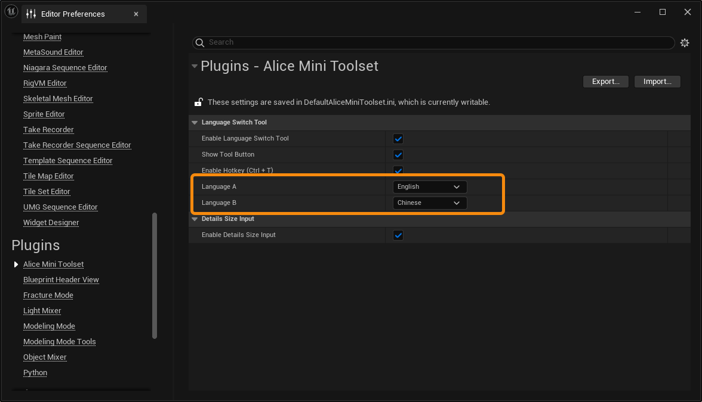
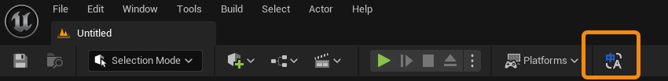
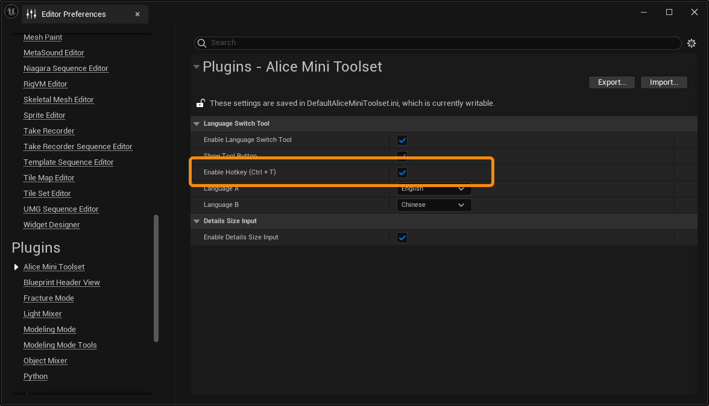

**Alice Mini Toolset** 是一套不定期更新的编辑器迷你工具集，它用于整合发布一些免费的简单有用的编辑器小工具。目前它包含 “Details Size Input” 和 “Language Switch Tool” 这两个小工具。

如果您发现您拥有关于虚幻引擎编辑器的任何小需求，并且如果您认为它拥有可以被做成一个简单的小工具的价值，欢迎您随时联系我们，我们会制作并将其加入这个免费小工具集中。

# 安装

下载 AliceMiniToolset 插件，打开虚幻引擎编辑器，打开 **Setting -> Plugins**，在 Plugins 面板中搜索 **AliceMiniToolset**，勾选以启用插件。

# Details Size Input 小工具

Details Size Input 小工具为 SceneComponent 细节面板添加一个 Size 输入，允许您直接预览或编辑该 SceneComponent 在关卡中的实际大小。
在 Actor 层面，Size 将显示或编辑该 Actor 中所有 SceneComponent 组件的整体大小。

## 启用小工具

打开 **Edit -> Editor Preferences**，找到 **Plugins** 分类下的 **Alice Mini Toolset** 设置栏目。勾选 **Enable Details Size Input** 启用小工具。

启用后，选择场景中任意 Actor，您将看到细节面板中 Scale 属性下新增的 Size 输入。

## 小工具细节

当您选中一个 **Actor** 时，将显示该 Actor 的整体大小。该大小会统计 Actor 中所有 SceneComponent 占据的总空间。

当您编辑 Actor 尺寸时，将以这个总空间大小为依据，对整个 Actor 应用对应的缩放值。

当您选中一个 **Component** 时，如果该 Component 是一个 SceneComponent，会在 Size 中显示该对象在空间中的实际大小。该大小会根据父对象以及自身缩放值改变而改变。

在本例中，Cube1 是一个尺寸为 100x100x100 的立方体，但是由于它所在的 Actor 拥有 0.8 的缩放值，因此它的尺寸现在为 80x80x80。

在蓝图编辑器中，无论一个 SceneComponent 是否是其他 SceneComponent 的子代，它都只会显示自身的本地尺寸。

这是一个功能上的缺陷，由于我们无法从蓝图的 USCS_Node 有效地获取它的父代信息，因此我们无法统计一个 SceneComponent 的父代缩放值。

# Language Switch Tool 小工具

Language Switch Tool 小工具让您能够更轻松地切换引擎编辑器的显示语言。您可以设置两种目标语言，通过按钮或者快捷键在两种目标语言之间来回切换。

## 启用小工具

打开 **Edit -> Editor Preferences**，找到 **Plugins** 分类下的 **Alice Mini Toolset** 设置栏目。勾选 **Enable Language Switch Tool** 启用小工具。

您可以在设置中指定目标语言。

通过开启或关闭 **Show Tool Button**，您可以控制切换按钮是否显示在 Toolbar 面板上。

通过开启或关闭 **Enable Hotkey（Ctrl+T）**，您可以开启或关闭小工具的切换快捷键（Ctrl+T）。

